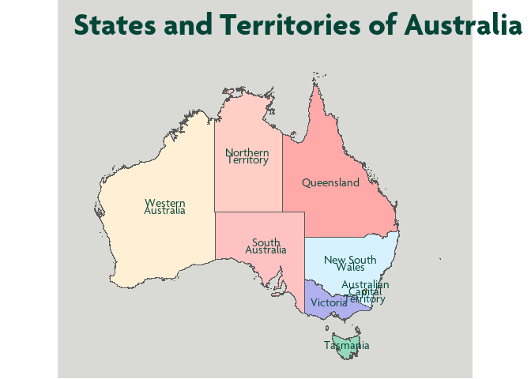
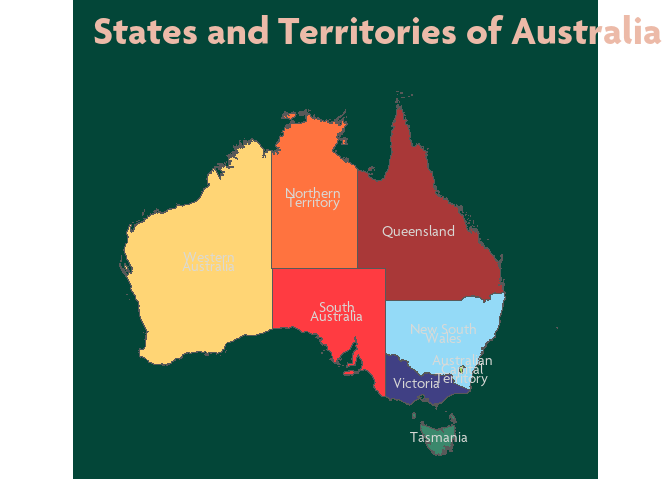

<!-- avoid border around images -->
<style>
    img {
        border-style: none;
        width: 80%;
    }
</style>
<!-- README.md is generated from README.Rmd. Please edit that file -->

# cubethemes

<!-- badges: start -->
<!-- badges: end -->

{cubethemes} is designed to enable cubies to create great data
visualisations that comply with the Cube Group Brand Guidelines.

## Installation

You can install the development version of {cubethemes} from github
using devtools:

``` r
# install.packages("devtools")
devtools::install_github("zerogetsamgow/cubethemes")
```

## Usage

{cubethemes} is designed to produce {gglot2} that comply with the Cube
Brand Guidelines simply. For example.

``` r
library(ggplot2)
library(tidyverse)
#> ── Attaching core tidyverse packages ───────── tidyverse 2.0.0 ──
#> ✔ dplyr     1.1.4     ✔ readr     2.1.5
#> ✔ forcats   1.0.0     ✔ stringr   1.5.1
#> ✔ lubridate 1.9.3     ✔ tibble    3.2.1
#> ✔ purrr     1.0.2     ✔ tidyr     1.3.1
#> ── Conflicts ─────────────────────────── tidyverse_conflicts() ──
#> ✖ dplyr::filter() masks stats::filter()
#> ✖ dplyr::lag()    masks stats::lag()
#> ℹ Use the conflicted package (<http://conflicted.r-lib.org/>) to force all conflicts to become errors
library(cubethemes)
library(cubepalette)
#> Loading required package: palettes
library(stringr)
## basic example code
ggplot2::ggplot(data=iris,aes(x=Sepal.Length, y = Petal.Length,colour=Species)) +
  geom_point(size=3) +
  scale_colour_manual(values=cube_palettes_discrete$dark,labels=stringr::str_to_title) +
  scale_x_continuous(name="Sepal length")+
  scale_y_continuous(name="Petal length")+
  theme_cube_white()
```


## Three themes to cubify them all

{cubethemes} exports three themes - `theme_cube_white()`(seen above),
`theme_cube_green()` and `theme_cube_orange` to enable plots to be
produced for any Cube publication.

Each of these themes is designed to work with different discrete
palettes from {cubepallete}:

- `theme_cube_white()` with `cube_palette_discrete$dark`

- `theme_cube_green()` with `cube_palette_discrete$light`

``` r
## basic example of a green plot
ggplot(data=iris,aes(x=Sepal.Length, y = Petal.Length,colour=Species)) +
  geom_point(size=3) +
  scale_colour_manual(values=cube_palettes_discrete$light,labels=stringr::str_to_title) +
  scale_x_continuous(name="Sepal length")+
  scale_y_continuous(name="Petal length")+
  labs(title="Sepal and petal lengths of irises")+
  theme_cube_green()
```


- `theme_cube_orange()` with `cube_palette_discrete$other`

These themes can also work with the `cube_palette_tints` palettes
`greys`,`greens` and `oranges`.

``` r
## basic example of a green plot
ggplot(data=mtcars,aes(x = as.factor(cyl), colour=NULL, fill=as.factor(cyl), group=cyl)) +
  geom_histogram(stat="count")+
  scale_fill_manual(name="Cylinders", values=cube_palettes_tints$greens,labels=stringr::str_to_title) +
  scale_y_continuous(name="Count", expand=c(0,0.04))+
  scale_x_discrete(name=NULL)+
  labs(title="Count of cylinders in mtcars")+
  theme_cube_orange()
#> Warning in geom_histogram(stat = "count"): Ignoring unknown
#> parameters: `binwidth`, `bins`, and `pad`
```


As well as utilising the {cubepalette} these themes are rendered using
{showtext} to allow the use of `Agenda` font. {cubetheme} installs these
fonts.

## Maps for any background

{cubethemes} exports a theme - `theme_cube_map()` to be used when
plotting maps. This theme can be produced with white, green, orange or
grey backgrounds. White is the default. Green and grey work with the
default background colours in Cube’s PowerPoint template.

    #> Linking to GEOS 3.11.2, GDAL 3.7.2, PROJ 9.3.0; sf_use_s2() is
    #> TRUE

``` r

## basic example of a map with grey background
ggplot(
  data = 
    strayr::read_absmap(
      name="state2021",
      remove_year_suffix = TRUE
      ) |> 
    filter(state_name %in% strayr::state_name_au) |> 
    mutate(state_name = 
             factor(
               state_name, 
               levels=strayr::state_name_au)
           ),
  aes(fill=state_name, x=cent_long, y =cent_lat, label = str_wrap(state_name,10))) +
  geom_sf() +
  geom_text(family="Agenda",colour = cubepalette::cube.darkgreen, lineheight=.5)+
  scale_fill_manual(guide='none',values=colorspace::lighten(strayr::palette_state_name_2016,.7)) +
  labs(title="States and Territories of Australia")+
  theme_cube_map(base_colour = "grey")
```



``` r

## basic example of a map with grey background
ggplot(
  data = 
    strayr::read_absmap(
      name="state2021",
      remove_year_suffix = TRUE
      ) |> 
    filter(state_name %in% strayr::state_name_au) |> 
    mutate(state_name = 
             factor(
               state_name, 
               levels=strayr::state_name_au)
           ),
  aes(fill=state_name, x=cent_long, y =cent_lat, label = str_wrap(state_name,10))) +
  geom_sf() +
  geom_text(family="Agenda",colour = cubepalette::cube.grey, lineheight=.5)+
  scale_fill_manual(guide='none',values=colorspace::lighten(strayr::palette_state_name_2016,.2)) +
  labs(title="States and Territories of Australia")+
  theme_cube_map(base_colour = "green")
#> Reading state2021 file found in C:\Users\SAMUEL~1\AppData\Local\Temp\RtmpU1Tgzk
```


